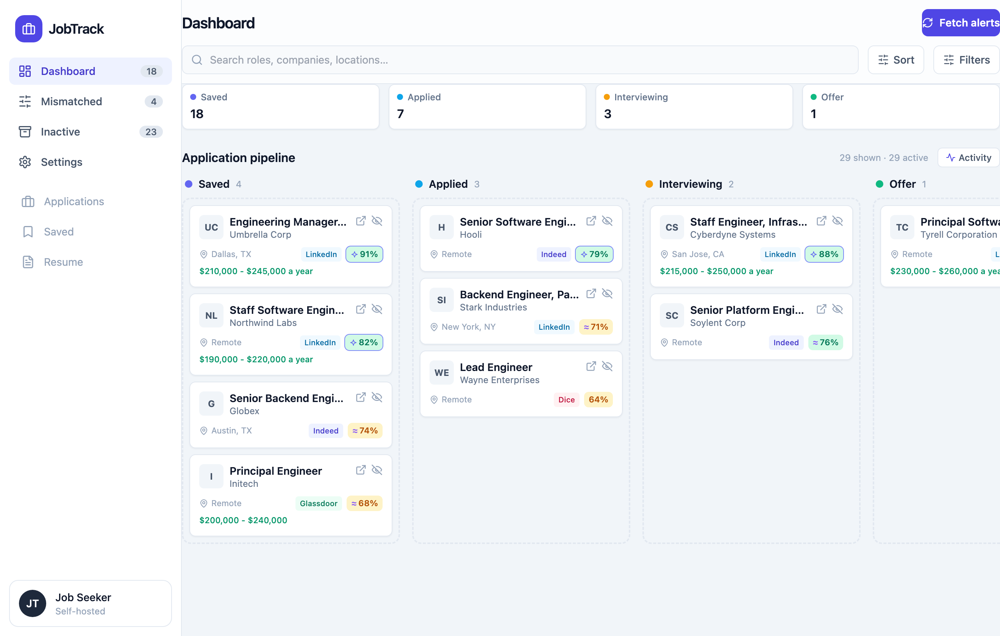
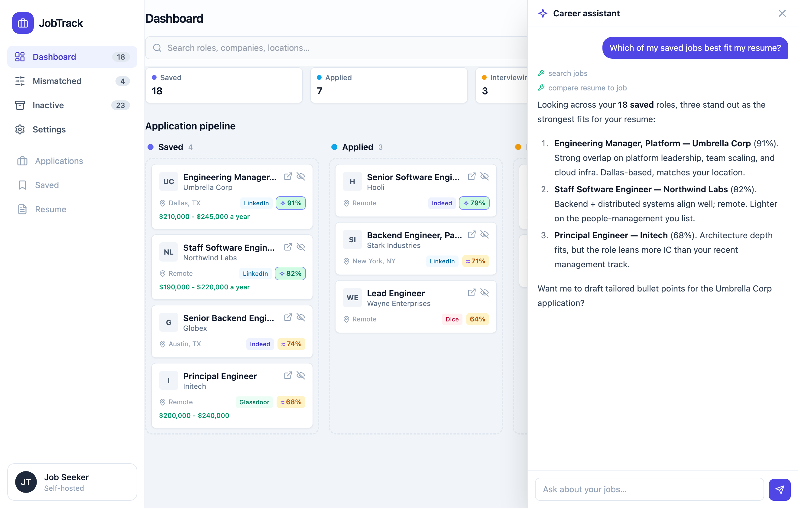
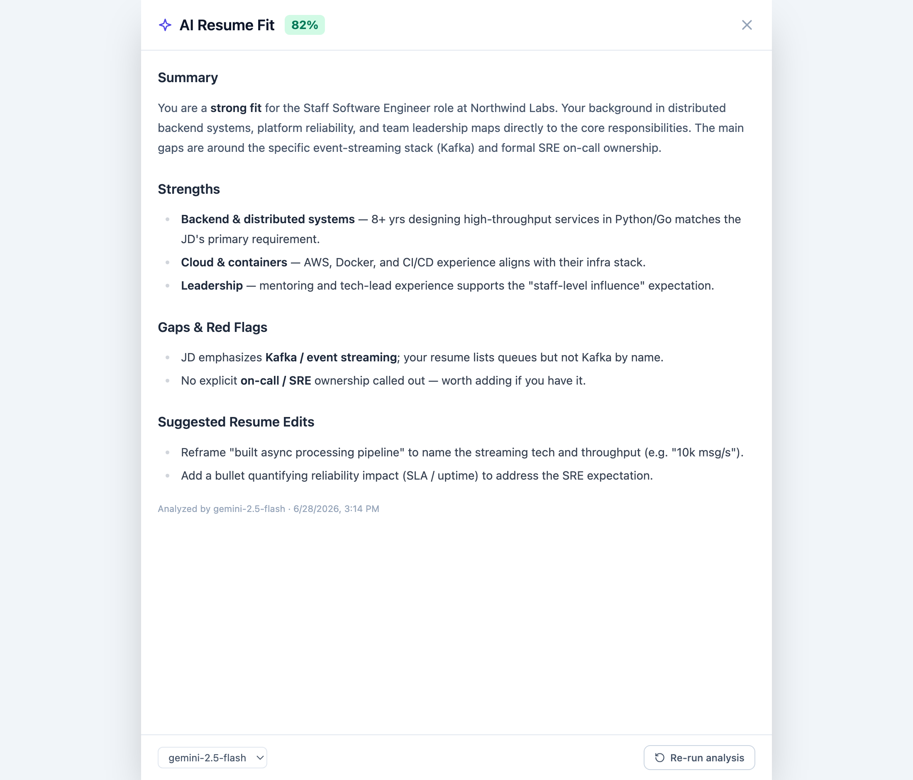
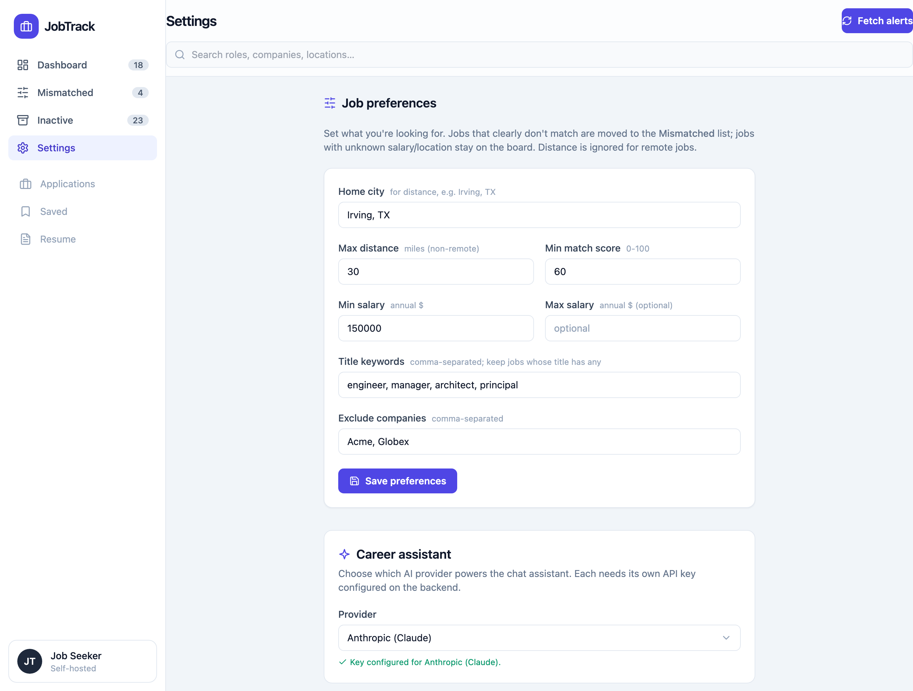
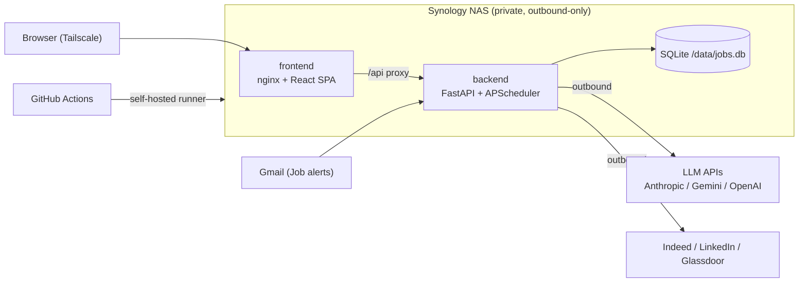

# JobTrack

> A self-hosted, AI-powered job-search tracker. It ingests job-alert emails from
> Gmail, fetches and scores each posting against your resume, and tracks it
> through a Kanban pipeline — with a provider-selectable, tool-using AI assistant
> on top.

<p align="left">
  <a href="https://github.com/gcheruku/jobtracker/actions/workflows/ci.yml"></a>
  
  
  
  
  
  
</p>

JobTrack is a single-user application that runs entirely on a home Synology NAS,
is reachable privately over Tailscale, and deploys itself via a self-hosted
GitHub Actions runner on every push to `main`. It is built to be **fully
functional with no API keys** (graceful degradation throughout) and to make the
**production AI patterns** — agentic tool use, multi-LLM abstraction, RAG-style
resume grounding, semantic search, streaming, and guardrails — concrete and
inspectable.

---

## Screenshots

| Kanban board | AI assistant |
|---|---|
|  |  |

| Resume compare | Settings |
|---|---|
|  |  |

> The real UI with synthetic sample data (fictional companies, no personal job
> data) — see [docs/screenshots/](docs/screenshots/).

---

## Key features

- **Kanban pipeline** (Saved → Applied → Interviewing → Offer) with drag-and-drop
  and optimistic updates.
- **Gmail ingestion** of Dice/LinkedIn/Glassdoor/Indeed alerts — scheduled every
  4h and via a manual **Fetch alerts** button; deduped by canonical posting id.
- **Job-description fetching** that defeats per-site anti-bot walls (browser TLS
  impersonation, link rewriting, host-scoped cooldowns).
- **Resume-fit analysis** — an LLM match score + Markdown report, with a
  deterministic offline heuristic fallback when no key is present.
- **Offline semantic matching** (sentence-transformers) — a no-LLM-cost
  resume↔JD signal computed at ingest time (optional build flag).
- **Provider-selectable AI assistant** — a tool-using agent over your pipeline,
  backed by Anthropic, Gemini, or OpenAI, streamed over SSE.
- **Preferences** (salary / location+distance / min score / keywords) that move
  non-matching jobs to a **Mismatched** view; skipped/expired/rejected go to
  **Inactive**.
- **Global search**, a job drawer with notes & checklists, and expiry detection.

---

## Architecture at a glance



Full write-up in [docs/Architecture.md](docs/Architecture.md). The AI assistant
is documented in [docs/AI-Agent.md](docs/AI-Agent.md).

---

## Technology stack

**Backend** — FastAPI · Uvicorn · SQLModel (SQLite) · APScheduler · Pydantic ·
BeautifulSoup + curl_cffi (scraping) · Anthropic / google-genai / OpenAI SDKs ·
sentence-transformers (optional).

**Frontend** — React 18 · TypeScript · Vite · TanStack Query · Tailwind CSS ·
@dnd-kit · react-markdown.

**Infra** — Docker Compose · self-hosted GitHub Actions runner · nginx ·
Tailscale.

---

## Quick start

> Requires Python 3.11+ and Node 18+. The app runs with **no keys** (reduced
> features); add keys to unlock AI. Full guide: [docs/Development.md](docs/Development.md).

```bash
# 1. Backend
cd backend
python3 -m venv .venv && source .venv/bin/activate
pip install -r requirements.txt
cp .env.example .env            # optional: add keys
uvicorn app.main:app --port 8000   # creates a fresh jobs.db on first run

# 2. Frontend (second terminal)
cd frontend
npm install
npm run dev                     # http://localhost:5173
```

API docs: <http://localhost:8000/docs>.

---

## Deployment

Push to `main` → a self-hosted GitHub Actions runner on the NAS runs
`docker compose up -d --build`. No inbound ports; remote access via Tailscale.
See [docs/Deployment.md](docs/Deployment.md) for the full NAS setup, CI/CD
pipeline, and the slim-vs-semantic build flag.

---

## Why I built this

JobTrack started as a real personal need — tracking a job search across four job
boards — and became a deliberate vehicle for hands-on, production-grade
experience with the patterns that now define applied AI engineering:

- **Agentic AI** — a hand-written tool-use loop (not an SDK auto-runner) so
  streaming, tracing, and termination are explicit and controllable.
- **Tool calling** — a typed tool surface (`search_jobs`, `get_job`,
  `get_pipeline_stats`, `compare_resume_to_job`) the model invokes to reason over
  live, per-user data.
- **Multi-LLM architecture** — one neutral event contract with three thin
  provider adapters (Anthropic / Gemini / OpenAI), selectable at runtime.
- **RAG / grounding** — answers and scores are grounded in the user's actual
  resume and the fetched job descriptions, not the model's priors.
- **Semantic search** — embedding-based resume↔JD similarity as a no-LLM-cost
  match signal.
- **AI guardrails** — read-only tools, a step cap, token tracing, and graceful
  "no key" degradation.
- **Streaming** — SSE-over-POST transport with a neutral event stream the UI
  renders incrementally (text, tool calls, tool results, usage).
- **Production AI systems** — observability, cost control, idempotent pipelines,
  and offline-first fallbacks so nothing hard-fails.
- **AI-assisted software engineering** — the project itself was specified and
  built with AI tooling; the prompts are kept under [`prompts/`](prompts/) for
  provenance.

A candid self-assessment lives in
[PORTFOLIO_REVIEW.md](PORTFOLIO_REVIEW.md).

---

## Documentation

| Doc | Contents |
|---|---|
| [docs/Architecture.md](docs/Architecture.md) | System design, data model, core flows, diagrams |
| [docs/AI-Agent.md](docs/AI-Agent.md) | The agentic layer: loop, providers, tools, guardrails |
| [docs/Deployment.md](docs/Deployment.md) | NAS deployment, CI/CD, operations |
| [docs/Development.md](docs/Development.md) | Local setup, configuration, troubleshooting |
| [TECHNICAL_DEBT.md](TECHNICAL_DEBT.md) | Known debt and improvement opportunities |
| [ROADMAP.md](ROADMAP.md) | Planned direction |
| [FAQ.md](FAQ.md) | Common questions |
| [CONTRIBUTING.md](CONTRIBUTING.md) · [SECURITY.md](SECURITY.md) · [CHANGELOG.md](CHANGELOG.md) | Project process |

---

## Repository layout

```
backend/    FastAPI app (routers thin, services do the work, agent/ is the AI layer)
frontend/   Vite + React SPA (components, lib)
deploy/     docker-compose + self-hosted runner config
docs/        Architecture, AI-Agent, Deployment, Development, screenshots
prompts/    The prompts used to build the app, kept for provenance
```

---

## Privacy & data

No personal data is in this repository. Your resume, Gmail credentials, `.env`,
and the SQLite database are gitignored; template/sample files are provided so you
can supply your own. See [SECURITY.md](SECURITY.md).

---

## License

[MIT](LICENSE) © Gopal Cheruku
