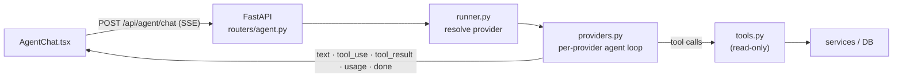
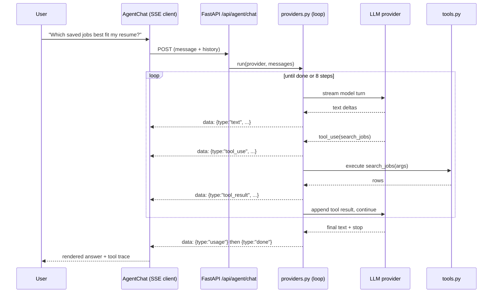

# AI Agent

JobTrack includes a floating chat assistant (`AgentChat.tsx`) backed by a
**tool-using agent** that operates over the user's job pipeline. It is
**provider-selectable** — Anthropic (Claude), Google Gemini, or OpenAI — driven
by a single tool surface and a neutral, streamed event contract.

> See also: [Architecture.md](Architecture.md) for the wider system.

---

## 1. Shape



The transport is **Server-Sent Events over a POST** request. The browser's
native `EventSource` is GET-only, so `lib/agent.ts` reads `response.body` as a
stream and parses `data:` frames manually; FastAPI returns a `StreamingResponse`
with `text/event-stream`.

---

## 2. The agent loop (`agent/providers.py`)

A **hand-written tool-use loop** (not an SDK auto tool-runner) so the app
controls streaming, tracing, and termination:

```
messages = history + user turn
repeat (cap: 8 steps):
    stream a model turn  -> emit text deltas to the client as they arrive
    if the model requested tools:
        execute each tool, emit tool_use / tool_result events
        append results to the conversation, loop
    else:
        emit "done", stop
```

Each step emits a **neutral event stream** the frontend renders:
`text`, `tool_use`, `tool_result`, `usage` (token trace), `done`, `error`.

### Sequence of an AI request



---

## 3. Provider abstraction

The agent is **provider-selectable in Settings**. The *same* tool surface drives
all three providers; each has its own native loop translating to and from the
neutral event stream:

- **Anthropic:** `messages.stream` with tool blocks + adaptive thinking
  (`claude-opus-4-8`).
- **Gemini:** `generate_content_stream` with `function_declarations`; tool calls
  read from response parts, results returned as `function_response` parts.
- **OpenAI:** Chat Completions streaming with `tool_calls` accumulated across
  delta fragments, results returned as `tool` messages.

The selection persists in `Settings.agent_provider` (the same preferences blob),
defaulting to the env var `AGENT_PROVIDER`. `GET /api/agent/status` reports the
selected provider and **which providers have a key**, so the UI warns when the
selected provider's key is missing. Only the selected provider needs a key.

**Adding a provider is one function** that implements the neutral event contract.

---

## 4. Tools (`agent/tools.py`)

Each tool is a JSON schema (sent to the model) plus an executor
`(args) -> dict` — a thin adapter over existing services / the DB.

| Tool | Purpose |
|---|---|
| `search_jobs` | Query the pipeline by text, status, score, source |
| `get_job` | Fetch a single job's full detail |
| `get_pipeline_stats` | Aggregate counts/metrics across the board |
| `compare_resume_to_job` | Run the resume-fit analysis for a job |

**All tools are read-only in v1**, so no action is destructive and no
human-in-the-loop approval gate is needed yet. The natural next layer is write
tools (set status / skip / add note) behind an approval queue — see
[ROADMAP.md](../ROADMAP.md).

---

## 5. Guardrails

- **Read-only tools** — the agent cannot mutate the pipeline.
- **Step cap (8)** — bounds tool-use loops and runaway cost.
- **Token tracing** — per-turn `usage` events surface spend to the UI.
- **Graceful "no key" degradation** — the assistant is disabled with a clear
  banner when the selected provider has no key; the rest of the app is unaffected.

---

## 6. Why an agent rather than a single prompt

The questions are open-ended and need live, per-user data — the model must
*decide* which jobs to look at, read their details, and compare them against the
resume. That is tool use plus a loop, not a single call. The core is
provider-agnostic (one neutral event contract); the provider-specific edges are
three small adapters.
