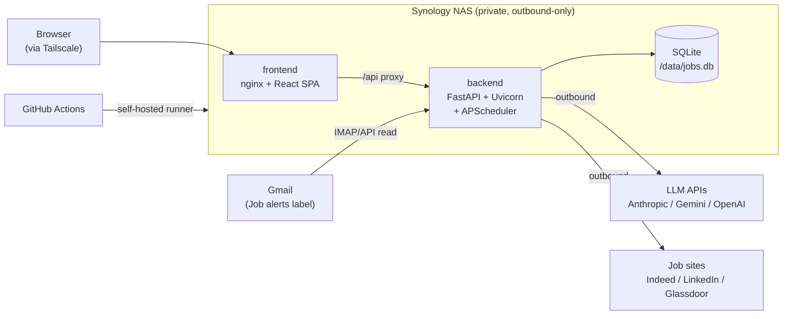
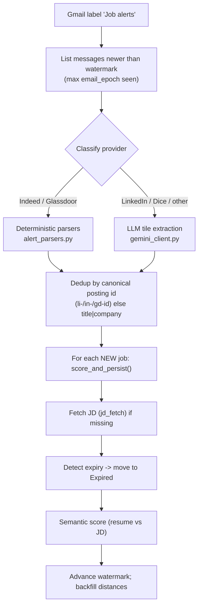
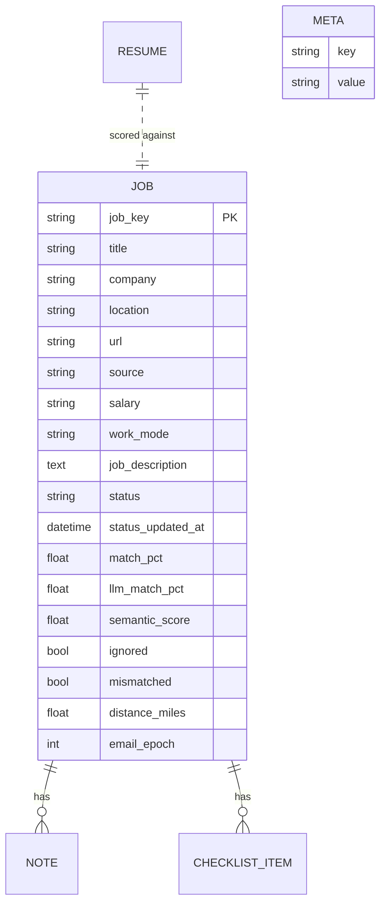

# Architecture

JobTrack is a self-hosted job-search tracker that ingests job-alert emails,
enriches and scores them against a resume, and presents them on a Kanban
pipeline — with a provider-selectable, tool-using AI assistant on top. This
document explains the system end to end.

> Companion docs: [AI-Agent.md](AI-Agent.md) (the agentic layer),
> [Deployment.md](Deployment.md) (infrastructure & CI/CD),
> [Development.md](Development.md) (local setup).

---

## 1. Overview

JobTrack reads job-alert emails from Gmail, parses the postings, fetches each
job description from the source site, scores every job against the user's resume
(LLM + an offline semantic fallback), and tracks them through a pipeline
(Saved → Applied → Interviewing → Offer). It runs entirely on a home Synology
NAS, reachable privately over Tailscale, and deploys itself via a self-hosted
GitHub Actions runner on every push to `main`. A Claude / Gemini / OpenAI agent
(tool use + streaming) answers natural-language questions over the pipeline.

---

## 2. System architecture



Key properties:

- **No inbound ports.** Deploys, LLM calls, JD fetches, and Gmail reads are all
  outbound-only. Remote access is via Tailscale (WireGuard mesh VPN); the app is
  never exposed to the public internet.
- **Two app containers:** `frontend` (nginx serving the built SPA and proxying
  `/api`) and `backend` (FastAPI). A third container, `gh-runner`, performs
  deploys.
- **State** lives in a mounted `/data` volume (SQLite DB, secrets, resume,
  `.env`) — outside the repo, never committed.

---

## 3. Technology stack

| Layer | Choice | Rationale |
|---|---|---|
| Backend | **FastAPI + Uvicorn** (Python 3.12) | Async, typed (Pydantic), auto OpenAPI docs |
| Persistence | **SQLite + SQLModel** | Single-user, file-backed, zero-ops; SQLModel = SQLAlchemy + Pydantic |
| Scheduling | **APScheduler** (in-process) | Periodic ingestion without a separate worker/cron |
| LLM | **Anthropic / Google Gemini / OpenAI** SDKs | Resume analysis + the agent; provider-selectable |
| Semantic match | **sentence-transformers** (optional) | Offline resume↔JD scoring with no LLM cost |
| Frontend | **React 18 + TypeScript + Vite** | Fast SPA build; no SSR needed (single-user, dynamic, behind auth) |
| Data fetching | **TanStack Query** | Server-state cache, optimistic updates, invalidation |
| Styling | **Tailwind CSS** | Utility-first; small, consistent UI |
| Drag/drop | **@dnd-kit** | Kanban board interactions |
| HTTP (scraping) | **requests + curl_cffi** | curl_cffi impersonates a browser TLS fingerprint to pass Cloudflare |
| Deploy | **Docker Compose + self-hosted GitHub runner** | NAS builds and runs images on push |
| Remote access | **Tailscale** | Private, encrypted, zero inbound ports |

---

## 4. Repository layout

```
backend/
  app/
    main.py            FastAPI app, middleware (CORS, request logging), router wiring, scheduler lifecycle
    config.py          Env-driven config (keys, models, paths, CORS); loads /data/.env in prod
    database.py        SQLModel engine + get_session dependency
    models.py          The Job table (+ notes, checklist, resume, geo_cache, meta)
    schemas.py         Pydantic request/response models (incl. Settings)
    scheduler.py       APScheduler setup: periodic ingest
    logging_config.py  Structured logging
    routers/           HTTP layer (thin): jobs, ai, ingest, stats, settings, semantic, resume, agent
    services/          Business logic (where the real work lives)
      gmail_client.py     Gmail OAuth + message fetch
      email_parser.py     Email -> provider + links/payload
      alert_parsers.py    Deterministic Indeed/Glassdoor parsers
      gemini_client.py    Gemini extraction + resume-fit analysis
      ingest.py           Orchestrates the ingestion pipeline (the heart)
      jd_fetch.py         Fetch + clean job descriptions (anti-bot aware)
      ai.py               Resume-fit (Gemini, or offline heuristic)
      semantic.py         Offline embedding-based resume↔JD scoring
      preferences.py      User settings storage + "apply to board" matching
      geo.py / distance.py  Geocoding + distance filtering
      resume_loader.py    Resume text extraction
    agent/             The AI assistant (see AI-Agent.md)
      tools.py            Tool schemas + executors (read-only over the pipeline)
      providers.py        Per-provider streaming tool-use loops (Anthropic/Gemini/OpenAI)
      runner.py           Resolves the selected provider, delegates
  Dockerfile           Slim image; optional WITH_SEMANTIC build arg

frontend/
  src/
    App.tsx            Top-level state, view switching, multi-select, mutations
    main.tsx           React/Query providers
    lib/
      api.ts           Typed REST client (fetch wrapper)
      agent.ts         SSE streaming client for the assistant
      types.ts         Shared TypeScript types
      filters.ts, ui.ts  Board filtering + display helpers
    components/        Board, drawer, focus view, search, settings, assistant, etc.
  nginx.conf           /api proxy, gzip, immutable asset caching
  vite.config.ts       Vendor code-splitting, dev proxy

deploy/
  docker-compose.yml   frontend + backend services
  gh-runner.example.yml  Self-hosted runner config (ACCESS_TOKEN)
```

**Architectural rule:** routers are thin (validation + wiring); all logic lives
in `services/`. This keeps the HTTP surface testable and the business logic
reusable — the scheduler and the agent both call services directly.

---

## 5. Core flows

### 5.1 Ingestion pipeline (`services/ingest.py`)

The heart of the app. Triggered by the scheduler (every N hours) or the
"Fetch alerts" button (`POST /api/ingest/run`, runs in a background task).



Design points:

- **Idempotent + incremental.** A watermark (latest `email_epoch`) plus
  canonical-id dedup means re-runs never double-insert; alerts are often resent.
- **Concurrency-safe.** A module-level lock plus a `status` dict make it safe to
  trigger from both the scheduler and the UI, and let the UI poll progress.
- **Deterministic-first.** Indeed/Glassdoor are parsed with regex/BS4 (reliable,
  free, and they capture salary) before falling back to the LLM — for cost and
  accuracy.

### 5.2 Job-description fetching (`services/jd_fetch.py`)

Job boards actively fight server-side scraping, and **each one differently**.

- **Link rewriting:** alert links are tracking redirects. Indeed `/rc/clk`,
  `/pagead` → canonical `viewjob?jk=<id>`; LinkedIn `/comm/jobs/view/<id>` →
  guest `/jobs/view/<id>` (both expose clean JSON-LD / markup).
- **Per-host HTTP client:** Cloudflare scores the **TLS/JA3 fingerprint**.
  Indeed/LinkedIn reject plain `requests` (a JS "Security Check") but accept
  `curl_cffi` impersonating Chrome's handshake; **Glassdoor is the inverse** —
  it blocks the impersonated fingerprint and accepts plain `requests`. The
  fetcher tries clients in a per-host order and treats a 200 "challenge" page as
  a failure (falling through to the other client).
- **Bot-wall cooldown:** once a host serves a challenge, fetches to that host
  pause for a window (in-memory, host-scoped) so the NAS IP isn't re-flagged by
  the every-N-hours ingest.
- **HTML → Markdown:** JSON-LD `JobPosting.description` (preferred) or known
  content selectors, converted to Markdown with correct **nested-list** handling.

### 5.3 Resume-fit analysis (`services/ai.py`, `gemini_client.py`)

`POST /api/ai/compare` builds `title/company + JD` vs resume text and asks the
LLM for a match score plus a Markdown report. **Graceful degradation:** with no
LLM key it returns a deterministic keyword-overlap heuristic, so the app is fully
functional offline.

### 5.4 Offline semantic scoring (`services/semantic.py`)

When `WITH_SEMANTIC=true`, sentence-transformers embeds the resume and JD and
scores cosine similarity — a no-LLM-cost match signal computed at ingest time.
Kept behind a build flag so the base image stays small for the 2 GB NAS.

### 5.5 Preferences ("apply to board") (`services/preferences.py`)

User settings (salary, distance, min match, title keywords, excludes) are stored
as a JSON blob in a `meta` row. "Apply" re-evaluates the board and moves clearly
non-matching jobs to a "Mismatched" bucket — **lenient**: unknown salary/location
stays on the board rather than being hidden.

---

## 6. Frontend architecture

- **Single-page app**, no router — the whole UI is view-switching state in
  `App.tsx` (dashboard / mismatched / inactive / settings / search / focus).
- **Server state via TanStack Query**; `lib/api.ts` is a typed `fetch` wrapper.
  Mutations use **optimistic updates** (dragging a card across columns flips
  status instantly, then reconciles with the server).
- **Key components:** `KanbanBoard` (dnd-kit columns), `JobDrawer` / `FocusView`
  (detail, side-by-side), `SearchResults`, `SettingsView`, `AgentChat`.
- **Performance work (measured):** the initial bundle was one ~180 KB-gzip chunk.
  It was reduced to ~92 KB gzip (~50%) by (a) splitting vendor chunks
  (`vite.config.ts` `manualChunks`), (b) lazy-loading the Markdown renderer, the
  drawer, and the focus view (so `react-markdown` and `framer-motion` leave the
  critical path), and (c) nginx gzip + immutable caching of hashed assets. SSR
  was deliberately *not* adopted — single-user, dynamic, behind-auth data gains
  nothing from it and it would add a Node runtime to a 2 GB NAS.

---

## 7. Data model (`models.py`)

One central `Job` table (SQLite), plus `note`, `checklist_item`, `resume`,
`geo_cache`, and a `meta` key/value table (watermark, preferences).



`job_key` is a stable identity derived from the posting id. The several scoring
signals (`match_pct`, `llm_match_pct`, `semantic_score`, `compare_*`) let the UI
sort and threshold without recomputing. `email_epoch` is the ingest watermark
source; `ignored` (skipped) and `mismatched` (failed a preference) keep jobs off
the board without deleting them.

---

## 8. Cross-cutting concerns

- **Security / CORS:** the SPA calls `/api` **same-origin** through the nginx
  proxy, so CORS isn't needed in normal use; it is locked to localhost dev
  origins by default (was `*`) to stop a malicious page from reaching a
  VPN-reachable instance. See [config.py](../backend/app/config.py).
- **Secrets:** never committed; the Gmail OAuth token and LLM keys live in
  `/data`/secrets. `reauth_gmail.py` regenerates the Gmail token when its refresh
  token is revoked.
- **Observability:** per-request logging middleware (method/path/status/ms);
  the agent emits per-turn token usage; ingest exposes a live `status` for the
  UI to poll.
- **Graceful degradation:** no LLM key → heuristic compare + a disabled assistant
  with a clear banner; no semantic deps → "no semantic scoring". Offline-first by
  design.

---

## 9. Notable engineering decisions

1. **Deterministic parsers before LLM** for Indeed/Glassdoor — cheaper, more
   reliable, and they capture salary the LLM often missed.
2. **Per-host anti-bot strategy + cooldown** — the *TLS fingerprint* (not headers)
   is the gate, and Glassdoor wants the opposite client from Indeed; a cooldown
   keeps the home IP from being re-flagged.
3. **Provider-agnostic agent** — one neutral event contract, three thin adapters;
   selectable at runtime; warns on missing keys. See [AI-Agent.md](AI-Agent.md).
4. **Bundle perf without SSR** — code-splitting + lazy loading + asset caching cut
   initial JS ~50%, the right call for a single-user dynamic app on low-RAM
   hardware.
5. **Outbound-only, self-hosted, private** — a self-hosted runner + Tailscale means
   no public surface and no cloud bill, while still getting push-to-deploy.
6. **Idempotent incremental ingestion** — watermark + canonical-id dedup makes
   re-runs safe despite resent alerts.
