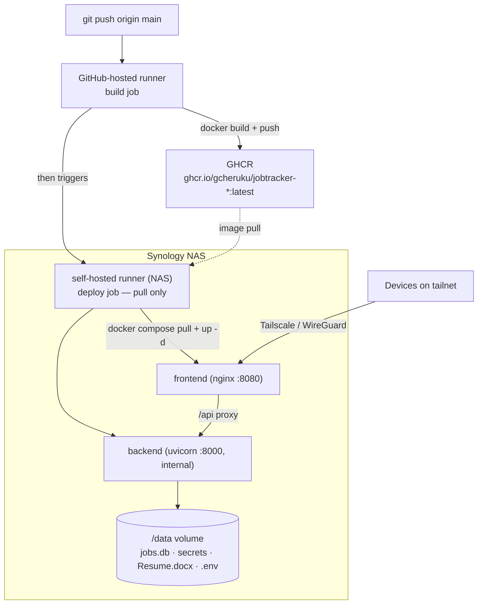
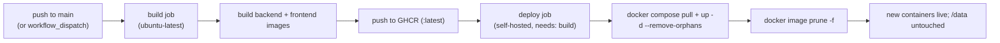

# Deployment

JobTrack deploys to a home **Synology NAS** via a **self-hosted GitHub Actions
runner**. The NAS only makes **outbound** calls to GitHub — no port-forwarding,
nothing inbound. The runner picks up the workflow, builds the images on the NAS,
and runs them with `docker compose`. Remote access is via **Tailscale**.

> See also: [Architecture.md](Architecture.md) and [Development.md](Development.md).

---

## 1. Deployment architecture



**Why build off-device:** the frontend (Vite) build is memory-heavy and can OOM a
2 GB NAS. Building on GitHub's hosted runners and having the NAS only **pull**
prebuilt images makes deploys fast and memory-safe.

## 2. CI/CD pipeline



The workflow is [`.github/workflows/deploy.yml`](../.github/workflows/deploy.yml):
a **build** job on `ubuntu-latest` pushes images to GHCR, then a **deploy** job on
the self-hosted runner (`needs: build`) pulls and restarts. Both authenticate to
GHCR with the built-in `GITHUB_TOKEN` (no extra secrets). A `concurrency` group
serializes deploys. Repo **Variables** (`DATA_DIR`, `WEB_PORT`, `WITH_SEMANTIC`)
parameterize the build/deploy without touching code.

A separate **quality gate** runs on GitHub-hosted runners — see
[`.github/workflows/ci.yml`](../.github/workflows/ci.yml) (backend `pytest` +
frontend `tsc -b && vite build`) on every PR and push to `main`. (It does not yet
block the self-hosted deploy; gating that on CI is tracked in
[TECHNICAL_DEBT.md](../TECHNICAL_DEBT.md).)

---

## 3. What gets deployed

- `frontend` (nginx) on `http://<NAS-IP>:8080` — serves the UI and proxies `/api`.
- `backend` (uvicorn) — internal only; reachable via the frontend proxy.
- A NAS folder `DATA_DIR` mounted at `/data` holds everything personal:
  `jobs.db`, `secrets/`, `Resume.docx`, `.env`, `hf-cache/`, `uploads/`.

---

## 4. Step 1 — Create the data folder on the NAS (one time)

SSH into the NAS (Control Panel → Terminal & SNMP → enable SSH), then:

```bash
sudo mkdir -p /volume1/docker/jobtracker/data/secrets
cd /volume1/docker/jobtracker/data

# Bring over your personal files (File Station or scp):
#   jobs.db                                       -> ./jobs.db   (optional; created fresh if absent)
#   backend/secrets/credentials.json, token.json  -> ./secrets/
#   Resume.docx                                   -> ./Resume.docx

# App secrets (NOT in git):
cat > .env <<'EOF'
GOOGLE_API_KEY=your-gemini-key
# GEMINI_MODEL=gemini-2.5-flash
# ANTHROPIC_API_KEY=sk-ant-...
# GMAIL_LABEL=Job alerts
# INGEST_INTERVAL_HOURS=4
EOF
```

> The backend reads `/data/.env` automatically. With no `jobs.db`, the app
> creates an empty one on first start.

## 5. Step 2 — Register a self-hosted runner (one time)

Authenticate the runner with a **Personal Access Token via `ACCESS_TOKEN`**, not
a one-time registration token. The image re-registers on every container start,
and a registration token expires in ~1 hour — so a `RUNNER_TOKEN` sends the
container into a register-fail → exit → restart loop once it lapses. With
`ACCESS_TOKEN` the entrypoint mints a fresh registration token from the GitHub
API on each boot, so restarts always work.

1. Create a **classic PAT** with the **`repo`** scope (GitHub → Settings →
   Developer settings → Personal access tokens → Tokens (classic)). A finite
   expiry (e.g. 1 year) is fine; rotate and rebuild when it lapses. Keep the
   token out of git.
2. In **Container Manager → Registry**, download `myoung34/github-runner:latest`.
3. **Container Manager → Container → Create** from that image with:
   - **Volume:** map `/var/run/docker.sock` → `/var/run/docker.sock` (lets the
     runner build/run containers on the NAS).
   - **Environment:**
     - `REPO_URL=https://github.com/gcheruku/jobtracker`
     - `ACCESS_TOKEN=<your classic PAT, repo scope>`
     - `RUNNER_NAME=synology`
     - `LABELS=self-hosted`
     - `RUNNER_SCOPE=repo`
   - Enable auto-restart.

   CLI equivalent over SSH:
   ```bash
   docker run -d --restart unless-stopped --name gh-runner \
     -v /var/run/docker.sock:/var/run/docker.sock \
     -e REPO_URL=https://github.com/gcheruku/jobtracker \
     -e ACCESS_TOKEN=<your-PAT> \
     -e RUNNER_NAME=synology -e LABELS=self-hosted -e RUNNER_SCOPE=repo \
     myoung34/github-runner:latest
   ```
   The runner should appear **Idle** under Settings → Actions → Runners.

4. (If your data path isn't the default) set repo **Variables** `DATA_DIR` and
   `WEB_PORT` under Settings → Secrets and variables → Actions → Variables.

## 6. Step 3 — Deploy

Push to `main` (or run **Build & Deploy** manually via Actions → Run workflow).
GitHub-hosted runners build both images and push them to **GHCR**; the NAS runner
then only **pulls** and restarts — no on-device build, so it can't OOM.

By default the backend is **slim** (no PyTorch). The Gemini "Compare with Resume"
feature works in slim mode; only the *offline* semantic resume↔JD matching is
omitted. To include it, set a repo **Variable** `WITH_SEMANTIC=true` (the build
job consumes it) and re-deploy.

### Images (GHCR)

Two packages are published under your account:
`ghcr.io/gcheruku/jobtracker-backend:latest` and `-frontend:latest`. Inside
Actions the deploy job authenticates with the built-in `GITHUB_TOKEN`. For a
**manual pull on the NAS** (outside Actions), either make the two GHCR packages
**public** (Package settings → Change visibility — the repo is already public and
the images hold no secrets), or `docker login ghcr.io` once with a PAT that has
`read:packages`.

### Manual deploy (no runner needed)

If the self-hosted runner is down, deploy straight from the NAS:

```bash
cd /path/to/repo   # needs deploy/docker-compose.yml
DATA_DIR=/volume1/docker/jobtracker/data \
  docker compose -f deploy/docker-compose.yml pull
DATA_DIR=/volume1/docker/jobtracker/data \
  docker compose -f deploy/docker-compose.yml up -d --remove-orphans
```

This pulls the latest prebuilt images and restarts — the same lightweight steps
the deploy job runs.

## 7. Step 4 — Use it

Open `http://<NAS-IP>:8080`. Click **Fetch alerts** to ingest (needs the Gmail
files in `secrets/`); the resume comes from `/data/Resume.docx`.

---

## 8. Operations notes

- **Security:** mounting `docker.sock` gives the runner root-equivalent access to
  the NAS — acceptable for a private repo you control. Keep the repo private if
  you fork it for real use.
- **Resources:** the default slim backend has no Torch and is small. Only the
  `WITH_SEMANTIC=true` build is large (Torch + `hf-cache`) and wants ~2 GB free
  RAM; don't enable it on a 2 GB DS220+.
- **Backend `/docs`:** to reach the API docs directly, add `ports: ["8000:8000"]`
  to the backend service (otherwise it's internal-only).
- **Rollback:** images are tagged `:latest`; to roll back, deploy an earlier
  commit (Actions → re-run, or `git revert`). Data in `DATA_DIR` is never touched
  by deploys.
- **Logs:** `docker logs jobtracker-backend` / `jobtracker-frontend` over SSH, or
  in Container Manager.
